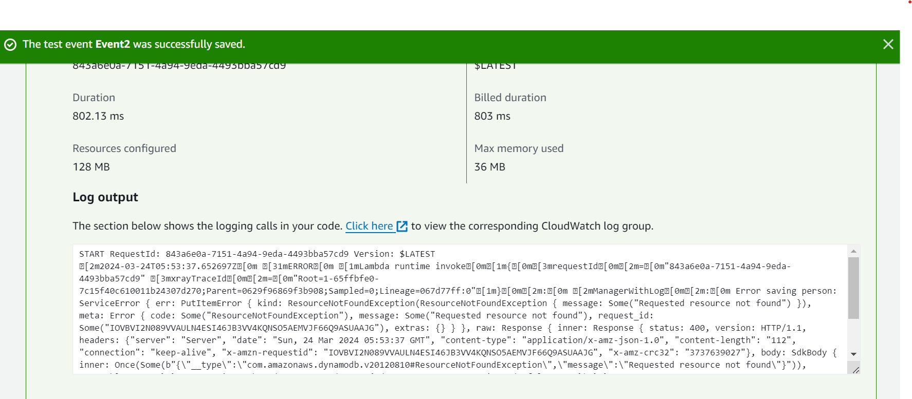
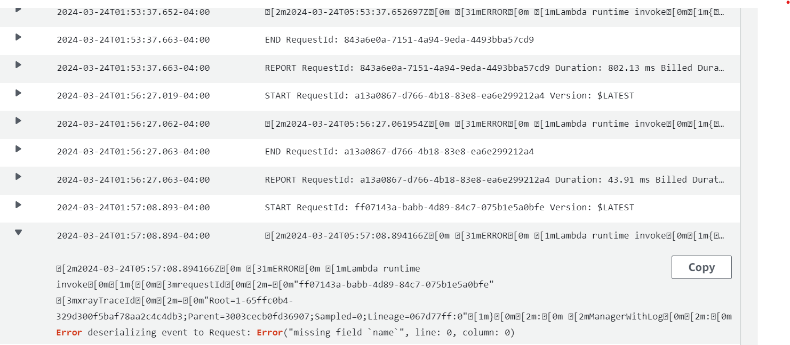
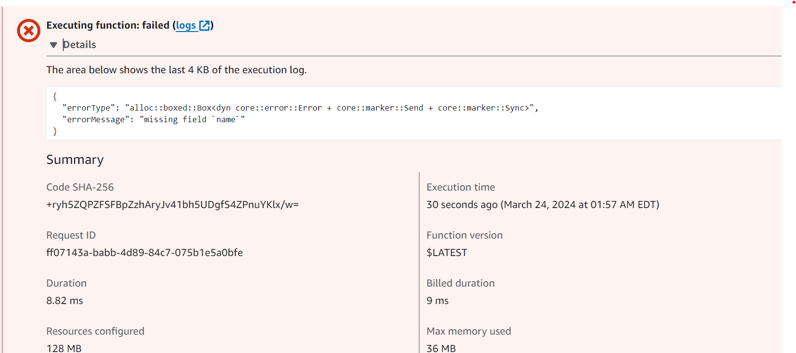
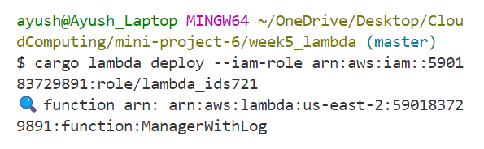
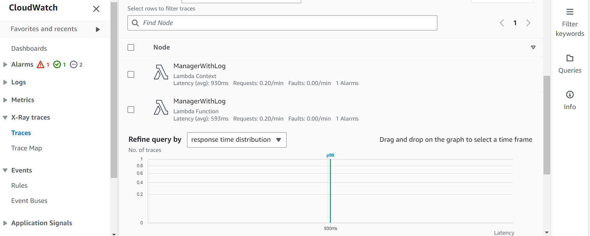

# Mini-Project 6: Rust Lambda Function with Logging and Tracing
> Ayush Gupta (NetID: ag758)

## Rust Lambda Functionality
The fundamental functionality remains consistent with the previous mini-project5: saving the information of a person (i.e., `{name: string, age: u8}`) passed to the API to the database. Additionally, it will provide a response indicating the piece of information that was added (i.e., "Inserted person record: {name}, {age} years old"). To enhance debugging and monitoring capabilities, logging and tracing features have been incorporated.

### Integrating Logging Into the Lambda Function

1. Update [Cargo.toml](./ManagerWithLog/Cargo.toml) to include the `tracing` and `tracing-subscriber` libraries:
```toml
tracing-subscriber = "0.3.18"
tracing = "0.1.40"

1. Implement logging in main.rs:
// Import necessary libraries
`use tracing::{info, Level};`
`use tracing_subscriber::FmtSubscriber;`

2. Initialize logging:

`#[tokio::main]
async fn main() -> Result<(), Error> {
    // Initialize logging
    let subscriber = FmtSubscriber::builder()
        .with_max_level(Level::INFO)
        .finish();
    
    tracing::subscriber::set_global_default(subscriber).expect("Unable to set global default");

    info!("Starting the ManagerWithLog service");

    let func = service_fn(handler);
    lambda_runtime::run(func).await?;
    Ok(())
}

`

**Integrating AWS X-Ray Tracing**
First, build and deploy the completed lambda function using the same IAM Role as in mini-project5, which already has permissions for AWSLambdaBasicExecutionRole, IAMFullAccess, AWSLambda_FullAccess, and AmazonDynamoDBFullAccess.

**Examining the Logs**
1. Correctly formatted:


1. Incorrectly formatted:




`cargo lambda build`

`cargo lambda deploy --iam-role <arn id>`


**Connecting Logs/Traces to CloudWatch**
In the Lambda section, enable additional monitoring tools.

Logs:
In the log groups, locate the log streams:
Specifically, within the details of the log for the incorrect case, find the Error information:




